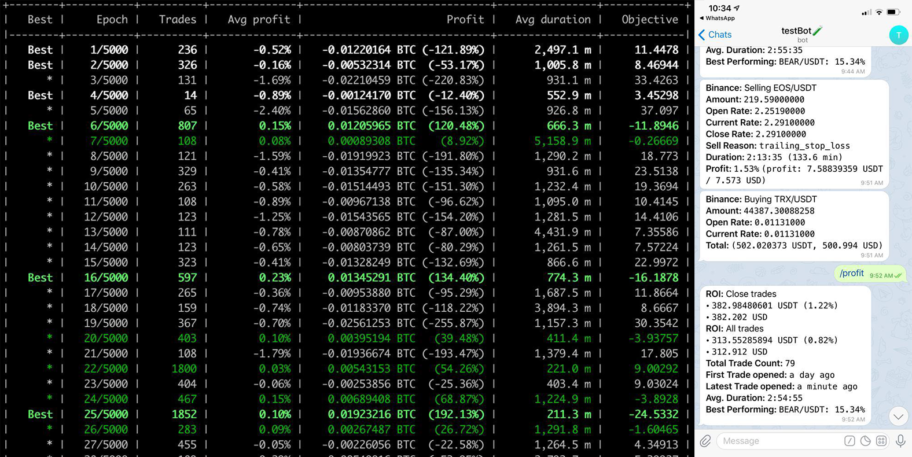

<!-- PROJECT SHIELDS -->
<!--
*** I'm using markdown "reference style" links for readability.
*** Reference links are enclosed in brackets [ ] instead of parentheses ( ).
*** See the bottom of this document for the declaration of the reference variables
*** for contributors-url, forks-url, etc. This is an optional, concise syntax you may use.
*** https://www.markdownguide.org/basic-syntax/#reference-style-links
-->
[![Stars][stars-shield]][stars-url]
[![Contributors][contributors-shield]][contributors-url]
[![Forks][forks-shield]][forks-url]
[![Python Badge]][Python Badge]
[![MIT License][license-shield]][license-url]
[![LinkedIn][linkedin-shield]][linkedin-url]


<!-- PROJECT LOGO -->
<br />
<p align="center">
  <a href="images/logo.jpg">
    
  </a>

  <h3 align="center">CRYPTO TRADING BOT</h3>

  <p align="center">
    Cryptocurrency bot to automate trading based on technical indicators.
    <br />
    <a href="https://https://github.com/lhandal/crypto-trading-bot"><strong>Explore the docs »</strong></a>
    <br />
    <br />
    <a href="https://https://github.com/lhandal/crypto-trading-bot">View Demo</a>
    ·
    <a href="https://https://github.com/lhandal/crypto-trading-bot/issues">Report Bug</a>
    ·
    <a href="https://https://github.com/lhandal/crypto-trading-bot/issues">Request Feature</a>
  </p>
</p>


<!-- TABLE OF CONTENTS -->
## Table of Contents

* [About the Project](#about-the-project)
  * [Built With](#built-with)
* [Getting Started](#getting-started)
  * [Prerequisites](#prerequisites)
  * [Installation](#installation)
* [Usage](#usage)
* [Roadmap](#roadmap)
* [Contributing](#contributing)
* [Disclaimer](#disclaimer)
* [License](#license)
* [Contact](#contact)
* [Acknowledgements](#acknowledgements)


<!-- ABOUT THE PROJECT -->
## About The Project

<!-- PROJECT LOGO -->
<br />
<p align="center">
  <a href="images/probs.png">
    
  </a>
  </p>
</p>

This project started with the motivation of automating an existing hobby I had, cryptocurrency trading.
After a bit of research I found this python package that could be programed to follow techincal indicators
and place orders for me using Binance's API and Telegram for commands. 

The strategy I use is base on Bollinger Bands (BB) and Relative Strength Index (RSI). More information on
these indicators can be found here: 
* [Bollinger Bands](https://www.investopedia.com/terms/b/bollingerbands.asp)
* [RSI](https://www.investopedia.com/terms/r/rsi.asp)

I used hyperparameter optimization for the strategy by backtesting the data on close prices from February 2019
to February 2020. The hyperopt yielded the following results:

* **BUY ORDER**: Place a buy order when closing price is below the lower BB (1 standard deviation) and RSI higher than 7.
* **SELL ORDER**: Place a sell order when closing price is above the upper BB (1 standard deviation) and RSI higher than 74.
* **STOP LOSS**: 6.49% loss
* **TRAILING STOP**: True 
* **TICKER INTERVAL**: 1H

The hyperparameter optimization took about 19 hours to complete, and all of the parameters are already set in the strategy provided. 
I used a daily Sharpe ratio ratio as objective for the optimization, since a profit maximization strategy was too volatile and riskier.
It yielded in average around $1300/month with a starting capital of $7500 (in backtest). 
Of course I expect this to have a lower monthly return when trading with real money due to slippages, volatility and liquidity of certain coins. 

The strategy is set to have 15 trades open at all time, allocating 99% of the total capital between them.

The quote currency for all trades is USDT and the list of base currencies can be found (and modified) in the `config.json` file.
For my strategy I used a static pair list for control, but if needed a dynamic list can be set based on current trading volume.


### Built With

* [Python](https://www.python.org/)
* [Telegram](https://telegram.org/)
* [Binance](https://www.binance.com/)
* [FreqTrade](https://www.freqtrade.io/en/latest/)
* [TA-Lib](https://github.com/mrjbq7/ta-lib)


<!-- GETTING STARTED -->
## Getting Started

To get a local copy up and running follow these simple steps.

### Prerequisites

- Docker 
- Telegram account
- Binance account

### Installation
 
1. Clone the repo
    ```shell script
    $ git clone https://github.com/lhandal/crypto-trading-bot.git
    ```

2. Create a blank Telegram bot with [BotFather](https://telegram.me/BotFather)

    This step is very simple to do, just go to the link above, talk to the botfather bot and follow the stps.
    More info and detailed steps in [this Medium article](https://medium.com/shibinco/create-a-telegram-bot-using-botfather-and-get-the-api-token-900ba00e0f39)

3. Get your Telegram Chat ID

    There is a bot that echoes your chat id upon starting a conversation.
    Just search for @chatid_echo_bot and tap /start. It will echo your chat id.

4. Copy your chat ID and the token provided by your new bot into the [config.json](config.json) file (lines 188 and 189). 

5. Create and get your [Binance](https://www.binance.com/) API keys.
    
    To do this just follow [this guide](https://medium.com/@cloud_20885/how-to-create-and-setup-binance-api-key-d2d5292c847b)!

6. Copy the API key and secret into the [config.json](config.json) file (lines 34 and 35).

And you're all done! Ready to run the bot!

<!-- USAGE EXAMPLES -->
## Usage

To start the bot inside a docker container just run:

```shell script
$ docker-compose run --rm freqtrade trade -s BB_RSI
```

## Features

To see a list of all available commands such as:
- Downloading price data
- Hyperparameter tuning
- Running the bot with different settings
- Plotting

Visit freqtrade's [documentation](https://www.freqtrade.io/en/latest/).

<!-- ROADMAP -->
## Roadmap

See the [open issues](https://github.com/lhandal/crypto-trading-bot/issues) for a list of proposed features (and known issues).

<!-- TODOS -->
## TODOs

* Download more data and keep back-testing.
* Create separate strategies for bearish, bullish and sideways markets.
* Test the bot with other indicators and currency pairs.


<!-- CONTRIBUTING -->
## Contributing

Contributions are what make the open source community such an amazing place to be learn, inspire, and create. Any contributions you make are **greatly appreciated**.

1. Fork the Project
2. Create your Feature Branch (`git checkout -b feature/AmazingFeature`)
3. Commit your Changes (`git commit -m 'Add some AmazingFeature'`)
4. Push to the Branch (`git push origin feature/AmazingFeature`)
5. Open a Pull Request

<!-- DISCLAIMER -->
## Disclaimer

This project is for informational purposes only, you should not construe any such information or other material as legal, tax, investment, financial, or other advice. Nothing contained here constitutes a solicitation, recommendation, endorsement, or offer by me or any third party service provider to buy or sell any securities or other financial instruments in this or in in any other jurisdiction in which such solicitation or offer would be unlawful under the securities laws of such jurisdiction.

Please only use the `dry-run` mode (paper money). 

If you plan to use real money **USE AT YOUR OWN RISK**. 

Under no circumstances will I be held responsible or liable in any way for any claims, damages, losses, expenses, costs or liabilities whatsoever including, without limitation, any direct or indirect damages for loss of profits.


<!-- LICENSE -->
## License

Distributed under the MIT License. See `LICENSE` for more information.


<!-- CONTACT -->
## Contact

[Leandro Handal](https://www.leandrohandal.com/)

- Email: [lhandalb@gmail.com](mailto:lhandalb@gmail.com)
- LinkedIn: [lhandal](https://linkedin.com/in/lhandal)
- Twitter: [@lhandalb](https://twitter.com/lhandalb)
- Instagram: [@lhandal](https://instagram.com/lhandal)

Project Link: [https://https://github.com/lhandal/crypto-trading-bot](https://https://github.com/lhandal/crypto-trading-bot)

<!-- MARKDOWN LINKS & IMAGES -->
<!-- https://www.markdownguide.org/basic-syntax/#reference-style-links -->
[contributors-shield]: https://img.shields.io/github/contributors/othneildrew/Best-README-Template.svg?style=flat-square
[contributors-url]: https://https://github.com/lhandal/crypto-trading-bot/graphs/contributors
[forks-shield]: https://img.shields.io/github/forks/lhandal/crypto-trading-bot.svg?style=flat-square
[forks-url]: https://github.com/lhandal/crypto-trading-bot/network/members
[stars-shield]: https://img.shields.io/github/stars/lhandal/crypto-trading-bot.svg?style=flat-square
[stars-url]: https://github.com/lhandal/crypto-trading-bot/stars
[license-shield]: https://img.shields.io/github/license/lhandal/crypto-trading-bot.svg?style=flat-square
[license-url]: https://https://github.com/lhandal/crypto-trading-bot/blob/master/LICENSE.txt
[linkedin-shield]: https://img.shields.io/badge/-LinkedIn-black.svg?style=flat-square&logo=linkedin&colorB=555
[linkedin-url]: https://linkedin.com/in/lhandal
[product-screenshot]: images/screenshot.png
[Python Badge]:https://img.shields.io/badge/Made%20with-Python-blue
